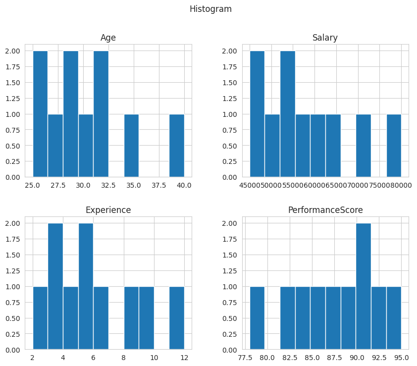
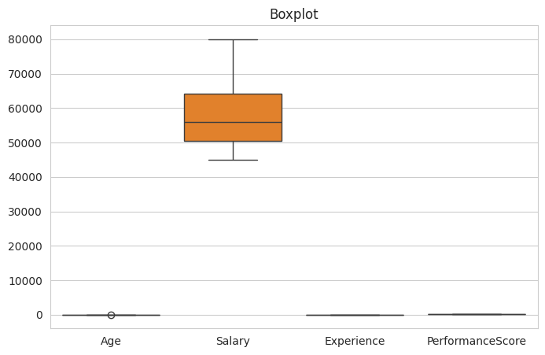
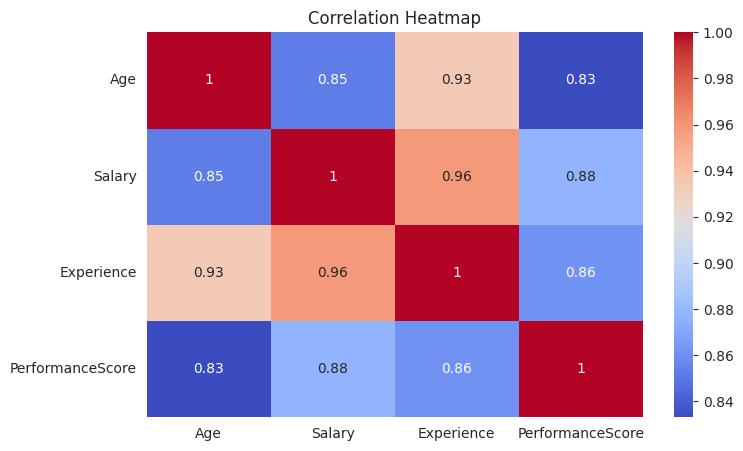
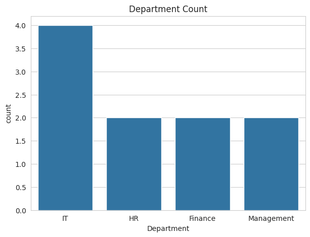
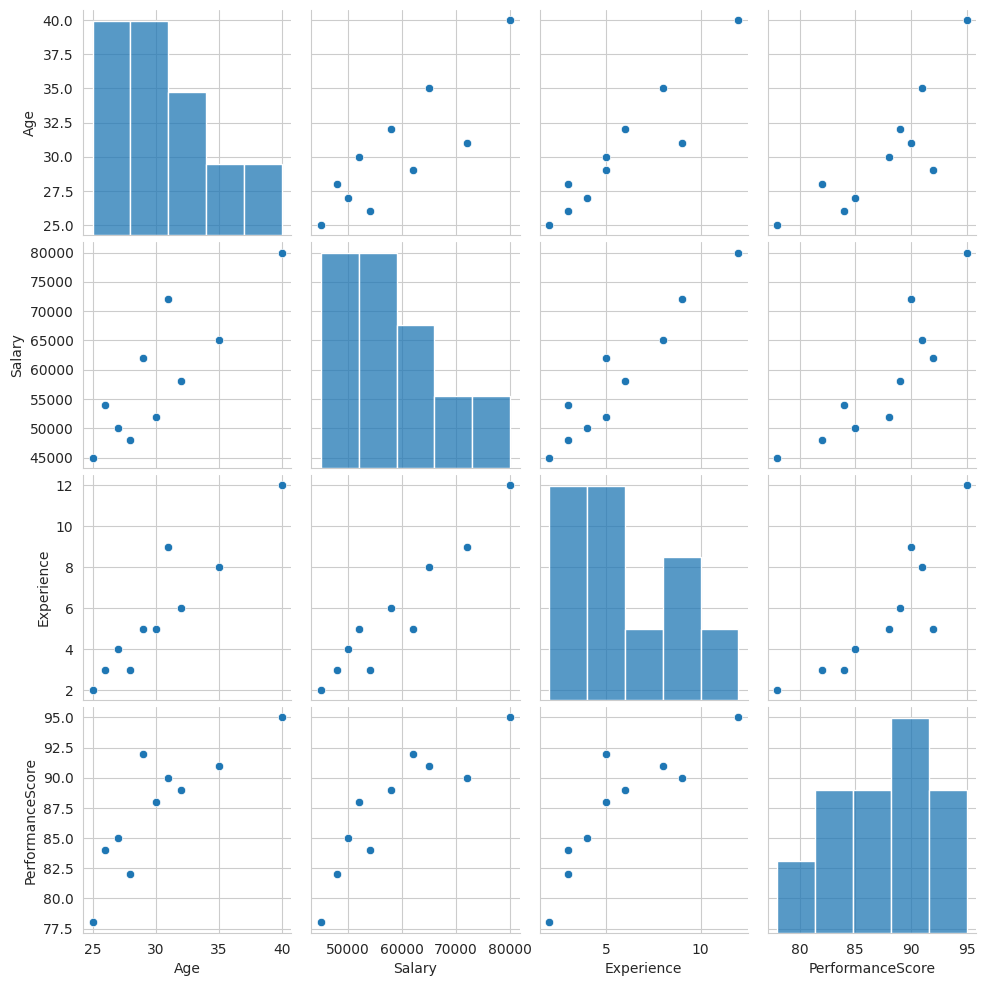

# EDA Output

## Histogram

## Boxplot

## Heatmap

## Countplot

## Pairplot

## Insights

1. The dataset contains no missing values.
2. The dataset contains no duplicate records.
3. Employee salaries vary across departments.
4. Experience shows a positive relationship with salary.
5. Performance scores generally increase with experience.
